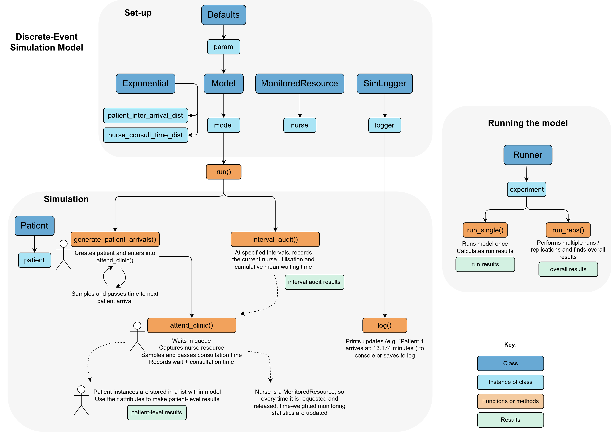

<div align="center">

# Simple M/M/s queuing model: Python DES RAP

[](https://www.python.org/)
[](https://github.com/pythonhealthdatascience/pydesrap_mms/blob/main/LICENSE)
[](https://doi.org/10.5281/zenodo.14622466)
[](https://github.com/pythonhealthdatascience/pydesrap_mms/actions/workflows/tests.yaml)
[](https://github.com/pythonhealthdatascience/pydesrap_mms/actions/workflows/lint.yaml)
[](https://orcid.org/0000-0002-6596-3479)
</div>

## Repository overview

This repository provides a reproducible analytical pipeline (RAP) for a simple **M/M/s queuing model** implemented in Python using SimPy. The model simulates patients arriving, waiting to see a nurse, being served, and leaving. All code is structured as a local Python package.

An M/M/s queueing model is a classic mathematical model for systems where:

* Arrivals happen at random, following a Poisson process - and the time between arrivals follows an exponential distribution (the first "M", which stands for "Markovian" as it is memoryless - arrivals are independent).
* Service times are exponential (second "M").
* There are s parallel servers (e.g. nurses) sharing a single queue.

This type of model is widely used for studying waiting lines in healthcare, call centers, and other service systems. It helps answer questions like: How long will people wait? How many servers are needed to keep waits short? The only required inputs are the average arrival rate, average service time, and the number of servers.

<br>

## Installation

Clone the repository:

```
git clone https://github.com/pythonhealthdatascience/pydesrap_mms.git
cd pydesrap_mms
```

Set up the Python environment using `conda` (recommended):

```
conda env create --file environment.yaml
conda activate
```

There is also a `requirements.txt` file whcih can be used to set up the environment with `virtualenv`, but this won't fetch a specific version of Python - so please note the version listed in `environment.yaml`.

<br>

## How to run

The simulation code is in the `simulation/` folder as a local package. Example analyses and model runs are in `notebooks/`.

**Load the local package:**

```{.r}
%load_ext autoreload
%autoreload 1
%aimport simulation

from simulation import Param, Runner, run_scenarios, summary_stats
# etc.
```

**Run a single simulation:**

```{.r}
param = Param()
experiment = Runner(param)
experiment.run_single()
```

**Run multiple replications:**

```{.r}
param = Param()
experiment = Runner(param)
experiment.run_reps()
```

**Run all example analyses (from command line):**

```{.bash}
bash run_notebooks.sh
```

**Run tests:**

```{.r}
pytest
# Run in parallel
pytest -n auto
# Run a specific test
pytest tests/testfile.py -k 'testname'
```

**Lint code:**

```{.r}
# Lint all files
bash lint.sh
# Lint specific .py file
pylint simulation/model.py
# Lint specific .ipynb file
nbqa pylint notebooks/analysis.ipynb
```

<br>

## How does the model work?

This section describes the purposes of each class in the simulation.

**Model Run Process:**

1. **Set Parameters:** Create a `Param` instance with desired model parameters.
2. **Initialise Model:** Instantiate `Model` using the parameters. During setup, `Model` creates `Exponential` instances for each distribution.
3. **Run Simulation:** Call `model.run()` to execute the simulation within the SimPy environment, running two processes:

    * `generate_patient_arrivals()` to handle patient creation, then sending them on to `attend_clinic()`.
    * `interval_audit()` to record utilisation and wait times at specified intervals during the simulation.

**Runner Class Usage:**

Having set up `experiment = Runner()`...

* **Single Run:** Use `experiment.run_single()` to execute a single model run.
* **Multiple Runs:** Use `experiment.run_reps()` to perform multiple replications of the model.

<br>



*Illustration of model structure created using [draw.io](https://draw.io/).*

<br>

## Reproducing results

TBC

<br>

## Input data

**Patient-level data** for our system is provided in the file: `inputs/NHS_synthetic.csv`.

**Data dictionary** (explaining each field) is available in: `inputs/NHS_synthetic_dictionary.csv`.

This dataset is **synthetic** and was generated in the `inputs/generator_scripts/synthetic_data_generation.ipynb`based on the the structure of some fields from the [Emergency Care Data Set (ECDS)](https://digital.nhs.uk/data-and-information/data-collections-and-data-sets/data-sets/emergency-care-data-set-ecds). The data generation process involved:

* **Arrivals:** Sampled from a Poisson distribution (average 15 patients per hour).
* **Wait times:** Sampled from an exponential distribution (average wait time: 5 minutes).
* **Service times:** Sampled from an exponential distribution (average service time: 10 minutes).
* **Time period:** Data covers one full year (1st January - 31st December 2025).

This dataset is released under the MIT licence. If you use this data, please cite this repository.

The code for input modelling is in: `notebooks/input_modelling.ipynb`. Model parameters are determined in this file and then stored in: `simulation/model.py`. Description for each parameter can be found in the class docstring within this file.

<br>

## GitHub actions

GitHub actions in `.github/workflows/` automate testing and code checks.

* **tests.yaml** runs the tests on Ubuntu, Windows, and Mac after each push to main.
* **lint.yaml** checks code style in python scripts and .ipynb files to maintain code quality.

<br>

## Repository structure

```
repo/
├── .github/workflows/    # GitHub actions
├── docs/                 # Documentation
├── images/               # Image files and GIFs
├── inputs/               # Folder to store any input data
├── notebooks/            # Run DES model and analyse results
├── outputs/              # Folder to save any outputs from model
├── simulation/           # Local package containing code for the DES model
├── tests/                # Unit and back testing of the DES model
├── .gitignore            # Untracked files
├── .pylintrc             # Pylint settings
├── CHANGELOG.md          # Describes changes between releases
├── CITATION.cff          # How to cite the repository
├── CONTRIBUTING.md       # Contribution instructions
├── environment.yaml      # Conda environment (includes Python version)
├── LICENSE               # Licence file
├── lint.sh               # Bash script to lint all .py and .ipynb files at once
├── pyproject.toml        # Metadata for local `simulation/` package
├── README.md             # This file! Describes the repository
├── requirements.txt      # Virtual environment (used by GitHub actions)
└── run_notebooks.sh      # Bash script to run all .ipynb from the command line
```

<br>

## Run time and machine specification

Run times from our analyses (on Intel Core i7-12700H, 32GB RAM, Ubuntu 24.04.1):

* `analysis.ipynb` - 37s
* `choosing_cores.ipynb` - 25s
* `choosing_replications.ipynb` - 11s
* `choosing_warmup.ipynb` - 3s
* `generate_exp_results.ipynb` - 2s
* `logs.ipynb` - 0s
* `time_weighted_averages.ipynb` - 0s

<!--TODO: Update run times -->

<br>

## Citation

If you use this repository, please cite either the GitHub repository or Zenodo:

> Heather, A. Monks, T. (2025). Python DES RAP Template. GitHub. https://github.com/pythonhealthdatascience/pydesrap_mms.
>
> Heather, A. Monks, T. (2025). Python DES RAP Template. Zenodo. https://doi.org/10.5281/zenodo.14622466

**Contributors:**

**Amy Heather** - developed the repository.

* [](https://orcid.org/0000-0002-6596-3479)
* [](https://github.com/amyheather)

**Tom Monks** - peer review of the repository.

* [](https://orcid.org/0000-0003-2631-4481)
* [](https://github.com/TomMonks)

<br>

## Licence

MIT Licence. See `LICENSE` for details.

<br>

## Acknowledgements

This repository was developed with thanks to several others sources. These are acknowledged throughout in the relevant notebooks/modules/functions, and also summarised here:

| Source | Find out more about how it was used... |
| - | - |
| Amy Heather, Thomas Monks, Alison Harper, Navonil Mustafee, Andrew Mayne (2025) On the reproducibility of discrete-event simulation studies in health research: an empirical study using open models (https://doi.org/10.48550/arXiv.2501.13137). | `docs/heather_2025.md` |
| NHS Digital (2024) RAP repository template (https://github.com/NHSDigital/rap-package-template) (MIT Licence) | `simulation/logging.py`<br>`docs/nhs_rap.md` |
| Sammi Rosser and Dan Chalk (2024) HSMA - the little book of DES (https://github.com/hsma-programme/hsma6_des_book) (MIT Licence) | `simulation/model.py`<br>`simulation/patient.py`<br>`simulation/runner.py`<br>`notebooks/choosing_cores.ipynb` |
| Tom Monks (2025) sim-tools: tools to support the Discrete-Event Simulation process in python (https://github.com/TomMonks/sim-tools) (MIT Licence)<br>Who themselves cite Hoad, Robinson, & Davies (2010). Automated selection of the number of replications for a discrete-event simulation (https://www.jstor.org/stable/40926090), and Knuth. D "The Art of Computer Programming" Vol 2. 2nd ed. Page 216. | `simulation/confidence_interval_method.py`<br>`simulation/onlinestatistics.py`<br>`simulation/plotly_confidence_interval_method.py`<br>`simulation/replicationsalgorithm.py`<br>`simulation/replicationtabulizer.py`<br>`notebooks/choosing_replications.ipynb` |
| Tom Monks, Alison Harper and Amy Heather (2025) An introduction to Discrete-Event Simulation (DES) using Free and Open Source Software (https://github.com/pythonhealthdatascience/intro-open-sim/tree/main). (MIT Licence) - who themselves also cite Law. Simulation Modeling and Analysis 4th Ed. Pages 14 - 17. | `simulation/monitoredresource.py` |
| Tom Monks (2024) [HPDM097 - Making a difference with health data](https://github.com/health-data-science-OR/stochastic_systems) (MIT Licence). | `notebooks/analysis.ipynb`<br>`notebooks/choosing_replications.ipynb`<br>`notebooks/choosing_warmup.ipynb` |
| Monks T and Harper A. Improving the usability of open health service delivery simulation models using Python and web apps (https://doi.org/10.3310/nihropenres.13467.2) [version 2; peer review: 3 approved]. NIHR Open Res 2023, 3:48.<br>Who themselves cite a [Stack Overflow](https://stackoverflow.com/questions/59406167/plotly-how-to-filter-a-pandas-dataframe-using-a-dropdown-menu) post. | `notebooks/analysis.ipynb` |

<br>

## Funding

This project was developed as part of the project STARS: Sharing Tools and Artefacts for Reproducible Simulations. It is supported by the Medical Research Council [grant number [MR/Z503915/1](https://gtr.ukri.org/projects?ref=MR%2FZ503915%2F1)].