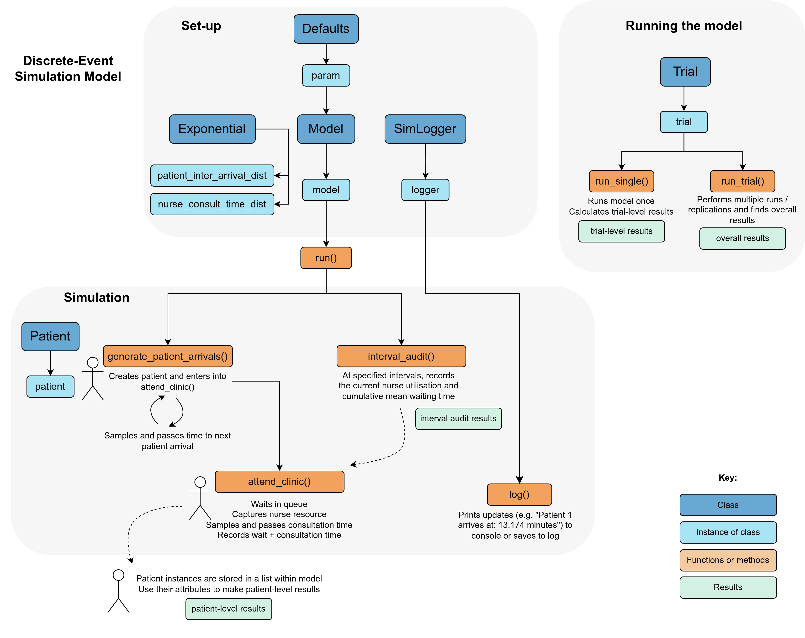

<div align="center">

# Simple Reproducible Python<br>Discrete-Event Simulation (DES) Template


A simple template for creating DES models in Python, within a **reproducible analytical pipeline (RAP)** <br>
Click on <kbd>Use this template</kbd> to initialise new repository.<br>
A `README` template is provided at the **end of this file**.

</div>

<br>

## 📌  Introduction

This repository provides a template for building discrete-event simulation (DES) models in Python.

😊 **Simple:** Easy-to-follow code structure using [SimPy](https://simpy.readthedocs.io/en/latest/). Implements a simple M/M/s queueing model in which patients arrive, wait to see a nurse, have a consultation with the nurse and then leave. Follows a modular structure: uses object-oriented programming, with the simulation implemented through classes.

♻️ **Reproducible:** This template is designed to function as a RAP. It adheres to reproducibility recommendations from:

* ["Levels of RAP" framework](https://nhsdigital.github.io/rap-community-of-practice/introduction_to_RAP/levels_of_RAP/) from the NHS RAP Community of Practice.
* Recommendations from [Heather et al. 2025](TODO:ADDLINK) "*On the reproducibility of discrete-event simulation studies in health research*".

🚀 **Extendable:** This template adapts from and complements material from Sammi Rosser and Dan Chalk (2024) ["HSMA - the little book of DES"](https://github.com/hsma-programme/hsma6_des_book). The book includes additional advanced features that can be used to extend the model in this template, including.

* Multiple activities
* Branching paths
* Priority-based queueing
* Reneging, blaking and jockeying
* Variable arrival rates
* Appointment booking

✨ **Style:** Coding style based on the [Google Python Style Guide](https://google.github.io/styleguide/pyguide.html). Used `flake8` and `pylint` to lint `.py` files, and `pycodestyle` for `.ipynb` files.

<!--TODO: Add links to STARS, relevant publication, and https://github.com/pythonhealthdatascience/rap_des/ -->

<br>

## 🧐 What are we modelling?

A **simulation** is a computer model that mimics a real-world system. It allows us to test different scenarios and see how the system behaves. One of the most common simulation types in healthcare is **DES**.

In DES models, time progresses only when **specific events** happen (e.g., a patient arriving or finishing treatment). Unlike a continuous system where time flows smoothly, DES jumps forward in steps between events. For example, when people (or tasks) arrive, wait for service, get served, and then leave.


*Simple model animation created using web app developed by Sammi Rosser (2024) available at https://github.com/hsma-programme/Teaching_DES_Concepts_Streamlit and shared under an MIT Licence.*

One simple example of a DES model is the **M/M/s queueing model**, which is implemented in this template. In a DES model, we use well-known **statistical distributions** to describe the behaviour of real-world processes. In an M/M/s model we use:

* **Poisson distribution** to model patient arrivals - and so, equivalently, use an **exponential distribution** to model the inter-arrival times (time from one arrival to the next)
* **Exponential distribution** to model server times.

These can be referred to as Markovian assumptions (hence "M/M"), and "s" refers to the number of parallel servers available.

For this M/M/s model, you only need three inputs:

1. **Average arrival rate**: How often people typically arrive (e.g. patient arriving to clinic).
2. **Average service duration**: How long it takes to serve one person (e.g. doctor consultation time).
3. **Number of servers**: How many service points are available (e.g. number of doctors).

This model could be applied to a range of contexts, including:

| Queue | Server/Resource |
| - | - |
| Patients in a waiting room | Doctor's consultation
| Patients waiting for an ICU bed | Available ICU beds |
| Prescriptions waiting to be processed | Pharmacists preparing and dispensing medications |

For further information on M/M/s models, see:

* Ganesh, A. (2012). Simple queueing models. University of Bristol. https://people.maths.bris.ac.uk/~maajg/teaching/iqn/queues.pdf.
* Green, L. (2011). Queueing theory and modeling. In *Handbook of Healthcare Delivery Systems*. Taylor & Francis. https://business.columbia.edu/faculty/research/queueing-theory-and-modeling.

<br>

## 🛠️ Using this template

### Step 1: Create a new repository

1. Click on <kbd>Use this template</kbd>.
2. Provide a name and description for your new project repository.
3. Clone the repository locally: 

```
git clone https://github.com/username/repo
cd repo
```

### Step 2: Set-up the development environment

Use the provided `environment.yaml` file to set up a reproducible Python environment with `conda`:

```
conda env create --file environment.yaml
conda activate
```

Note: The provided environment.yaml file is a snapshot of the environment used when creating the template, including specific package versions. You can update this file if necessary, but be sure to test that everything continues to work as expected after any updates. Also note that some dependencies are not required for modelling, but instead served other purposes, like running `.ipynb` files and linting.

### Step 3: Explore and modify

Review the example DES implementation in `scripts`. Modify and extend the code as needed for your specific use case.

A template `README` is provided at the end of this file.

You can lint the `.py` files by running either of this commands from the terminal:

```
flake8 scripts/simulation/model.py
pylint scripts/simulation/model.py
```

The first commands in the `.ipynb` files will lint the notebooks using `pycodestyle` when executed:

```
%load_ext pycodestyle_magic
%pycodestyle_on
```

<br>

## ❓ How does the model work?

**Model Run Process:**

1. **Set Parameters:** Create a `Defaults` instance and modify it with desired model parameters.
2. **Initialise Model:** Instantiate `Model` using the parameters. During setup, `Model` creates `Exponential` instances for each distribution.
3. **Run Simulation:** Call `model.run()` to execute the simulation within the SimPy environment, running two processes:

    * `generate_patient_arrivals()` to handle patient creation, then sending them on to `attend_clinic()`.
    * `interval_audit()` to record utilisation and wait times at specified intervals during the simulation.

**Trial Class Usage:**

* **Single Run:** Use `trial.run_single()` to execute a single model run.
* **Multiple Runs:** Use `trial.run_trial()` to perform multiple replications of the model.



<br>

## 📂 Repository structure

```
repo/
├── docs/                 # Documentation
├── scripts/              # Code for DES model and analysis
├── tests/                # Unit tests
├── .gitignore            #
├── environment.yaml      # Conda environment
├── LICENSE               # Licence file
└── README.md             #
```

<br>

## 📝 Citation

If you use this template in your research or poject, please cite as follows:

```
Amy Heather, "Simple Reproducible Python DES Template", 2024, GitHub repository: https://github.com/pythonhealthdatascience/rap_template_python_des.
```

| Contributor | ORCID | GitHub |
| --- | --- | --- |
| Amy Heather | [](https://orcid.org/0000-0002-6596-3479) | https://github.com/amyheather |

<br>

## 📜 Licence

This template is licensed under the MIT License.

```
MIT License

Copyright (c) 2024 STARS Project Team

Permission is hereby granted, free of charge, to any person obtaining a copy
of this software and associated documentation files (the "Software"), to deal
in the Software without restriction, including without limitation the rights
to use, copy, modify, merge, publish, distribute, sublicense, and/or sell
copies of the Software, and to permit persons to whom the Software is
furnished to do so, subject to the following conditions:

The above copyright notice and this permission notice shall be included in all
copies or substantial portions of the Software.

THE SOFTWARE IS PROVIDED "AS IS", WITHOUT WARRANTY OF ANY KIND, EXPRESS OR
IMPLIED, INCLUDING BUT NOT LIMITED TO THE WARRANTIES OF MERCHANTABILITY,
FITNESS FOR A PARTICULAR PURPOSE AND NONINFRINGEMENT. IN NO EVENT SHALL THE
AUTHORS OR COPYRIGHT HOLDERS BE LIABLE FOR ANY CLAIM, DAMAGES OR OTHER
LIABILITY, WHETHER IN AN ACTION OF CONTRACT, TORT OR OTHERWISE, ARISING FROM,
OUT OF OR IN CONNECTION WITH THE SOFTWARE OR THE USE OR OTHER DEALINGS IN THE
SOFTWARE.
```

<br>

## 💰 Funding

This project was developed as part of the project STARS: Sharing Tools and Artefacts for Reproducible Simulations. It is supported by the Medical Research Council [grant number [MR/Z503915/1](https://gtr.ukri.org/projects?ref=MR%2FZ503915%2F1)].

## 📄 Template for your project

Delete everything from this line and above, and use the following structure as the starting point for your project README:
___

<br>
<br>
<br>

<div align="center">

# Your Project Name


</div>

## Description

Provide a concise description of your project.

<br>

## Installation

Provide instructions for installing dependencies and setting up the environment.

<br>

## How to run

Provide step-by-step instructions and examples.

<br>

## Citation

Explain how to cite your project and include correct attribution for this template.
